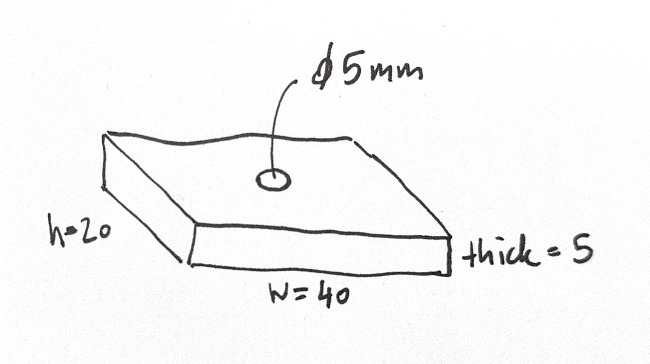

# Design Principles

Designing with CodeCAD is not just about typing Lua code — it’s about thinking like an **engineer**, **maker**, or **designer**. The workflow combines observation, planning, and coding into a smooth process that turns ideas into real-world parts.

## From Idea to Code

A typical CodeCAD design follows five steps:

1. **Observe**<br>
   Look at the problem you want to solve. What is missing, broken, or worth improving?
2. **Think**<br>
   Imagine possible solutions. Which geometry fits the purpose? Box, cylinder, or a combination? Should it be strong, lightweight, adjustable?
3. **Sketch**<br>
   Make quick hand drawings or notes. Sketching helps clarify proportions and constraints before coding.
4. **Identify Measurements**<br>
   Collect the critical dimensions: length, width, hole diameter, clearances, tolerances. This ensures your design will fit in the physical world.
5. **Code**<br>
   Translate the idea into Lua using CodeCAD primitives, transforms, and operations. Since the model is parametric, changing one measurement later will update the whole part.

<figure markdown>
    
    <figcaption>Design workflow with CodeCAD.</figcaption>
</figure>

!!! info "Most of the effort happens in thinking. Like in software engineering, good design starts with clear thinking about components, architecture, and the final goal. Coding is usually the smallest fraction of the work. If the design is clear, the Lua script is straightforward to write."

## Why This Matters

Many CAD tools encourage "click-and-drag modeling". CodeCAD, however, focuses on parametric, code-first design.
This approach makes your designs:

- Reproducible – The same code always generates the same part.
- Adaptable – Change one parameter and regenerate for a new size or variant.
- Documented – The Lua script is both your model and its specification.

## Example Workflow

Imagine you want to design a mounting bracket with a hole for a screw:

Sketch on paper:

<figure markdown>
    
    <figcaption>Simple block with a centered hole.</figcaption>
</figure>

The parameters for this bracket are as follows:

- Width: 40 mm
- Height: 20 mm
- Thickness: 5 mm
- Screw hole: Ø 5 mm in the center

Code in Lua:

```lua
local width = 40
local height = 20
local thickness = 5
local hole_diameter = 5

-- Base plate
local plate = box(width, height, thickness)

-- Hole
local hole = cylinder(hole_diameter, thickness)

hole = translate(hole, width / 2, height / 2, 0)

-- Cut hole through plate
local bracket = difference(plate, hole)

emit(bracket)
```

This simple script is fully parametric: change hole_diameter = 8 and regenerate to adapt the bracket instantly.

<figure markdown>
    
    <figcaption>Same block in CodeCAD with parametric settings.</figcaption>
</figure>

## Common Pitfalls

!!! warning "Beginner Pitfalls"

- Jumping into code too early: Without a clear idea or sketch, the model becomes messy and hard to adjust.
- Ignoring measurements: Guessing dimensions often leads to parts that don’t fit in real life.
- Overcomplicating the first version: Start simple, then refine. Complex assemblies are easier when built step by step.
- Forgetting tolerances: A part that looks perfect in CAD may not fit after printing or machining if no clearance is added.

## Key Takeaways

- Spend most of your time thinking and sketching — coding is just the translation step.
- Start with real-world needs, not abstract shapes.
- Use sketching and measurement to clarify the problem.
- Code your model as parametric Lua, so it stays adaptable.
- Let CodeCAD be the catalyst that turns ideas into physical parts.
