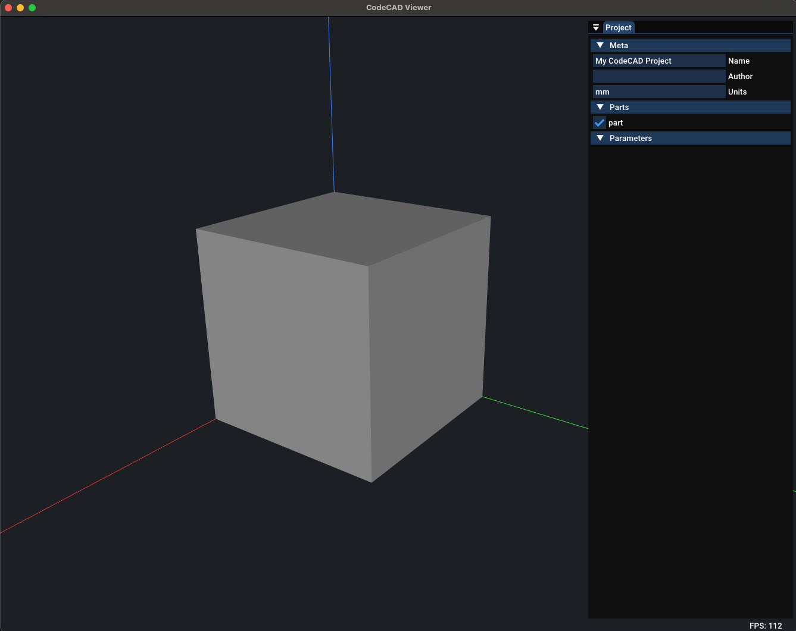
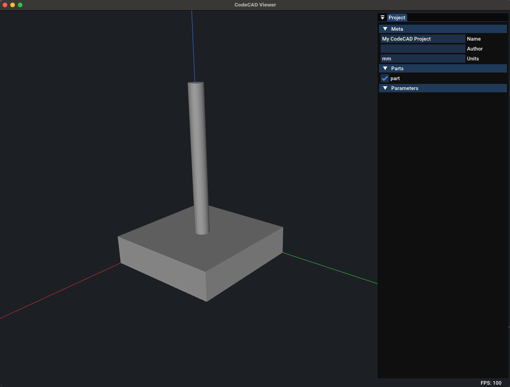

# Getting Started

CodeCAD is designed to be simple and developer-friendly. The easiest way to begin is through the CLI tool `ccad`.

## The CLI

You can always check available commands with:

```bash
ccad --help
```

But instead of starting from scratch, CodeCAD provides scaffolding to spin up a ready-to-use project.

## Your First Project

Run the following commands in your terminal:

```bash
mkdir first_project && cd first_project
ccad init
ccad lsp
ccad parts add
ccad live
```

Here’s what happens step by step:

- `ccad init`<br>
  Creates a new project configuration (`project.json`) and initializes the folder.
- `ccad lsp`<br>
  Sets up Language Server Protocol (LSP) support so that your editor (e.g. Neovim, VSCode) has code completion, inline docs, and validation.
- `ccad parts add`<br>
  Adds your first part file in `parts/`. By default, this contains a boilerplate Lua script with a simple cube.
- `ccad live`<br>
  Starts the interactive PURE viewer. Keep it running — it automatically reloads whenever you edit your Lua files.

<figure markdown>
    
    <figcaption>Your first project in the PURE viewer.</figcaption>
</figure>

Your project structure now looks like this:

```
├── README.md
├── generated/ # STL/STEP exports go here
├── parts/ # Lua parts you define
│ └── part.lua
└── project.json # Project configuration
```

Open the part file in your editor:

```bash
nvim parts/part.lua
```

## Understanding the Lua Script

Here’s the default cube example:

```lua
local cube = box(20, 30, 40)
emit(cube)
```

Line by line:

- `box(20, 20, 20)`<br>
  Creates a solid cube with width = 20mm, depth = 30mm, height = 40mm.
  All units are in millimeters by default.
- `emit(cube)`<br>
  Emits the shape to the viewer and export pipeline. Think of emit as "make this visible and part of my design".

## Adding More Shapes

Let’s extend the part by combining shapes:

```lua
local base = box(40, 40, 10) -- A flat base plate
local pillar = cylinder(5, 50) -- A vertical pillar
pillar = translate(pillar, 20, 20, 10) -- Move pillar on top of the base and center on the cube

local model = union(base, pillar) -- Boolean union of both
emit(model)
```

Now your viewer updates instantly to show a base plate with a centered pillar.

<figure markdown>
    
    <figcaption>Pillar centered on a cube.</figcaption>
</figure>

## Using Functions

You can also structure your Lua code with functions to make reusable parts:

```lua
-- Create a simple bracket
local function bracket(width, height, thickness)
  local plate = box(width, thickness, height)
  local hole = cylinder(3, thickness * 2)
  hole = translate(hole, width/2, 0, height/2)
  return difference(plate, hole)
end

local part = bracket(30, 50, 5)
emit(part)
```

This creates a parametric bracket with a hole. Try editing the parameters (30, 50, 5) and watch the viewer update live.

## Next Steps

Now that you've built your first parts, you can:

- Explore more primitives: sphere, cone, rod, hex_prism, ...
- Try boolean operations: union, difference, intersection

You are ready to start modeling with CodeCAD 🎉
