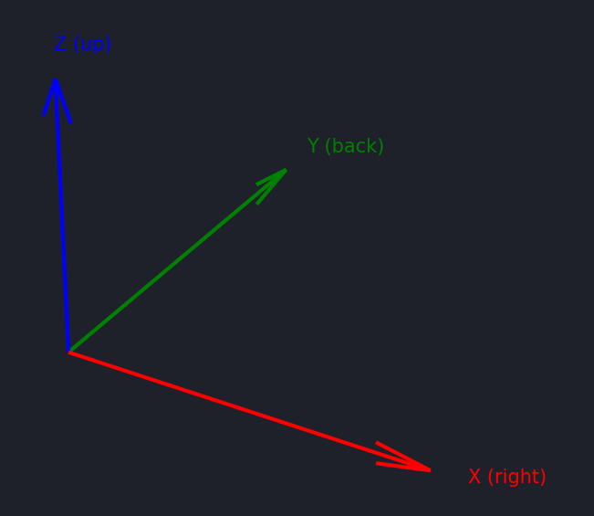
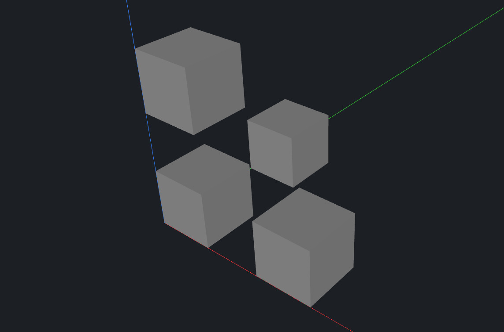

# CodeCAD in Practice

CodeCAD is more than just individual Lua scripts. A full project ties together parts, parameters, materials, and metadata into a reusable, adaptable design. Projects are stored in a human-readable JSON file (`project.json`) so that they can be shared, versioned, and modified easily.

This section explains how projects work and how they connect to real-world workflows such as 3D printing and construction.

## Coordinate System

CodeCAD uses a right-handed 3D coordinate system, which defines how shapes are placed in space. Understanding the axes is crucial, because every primitive, transformation, and operation builds on this foundation.

- X axis → left / right
- Y axis → front / back
- Z axis → bottom / top

<figure markdown>
    
    <figcaption>CodeCAD coordinate system.</figcaption>
</figure>

By convention:

- The origin (0, 0, 0) is the reference point for all coordinates.
- Positive X goes to the right, negative X to the left.
- Positive Y goes backward, negative Y goes forward.
- Positive Z goes up, negative Z goes down.

### Why This Matters

- Placing parts – When you use translate, you are moving objects along these axes.
- Rotations – Functions like `rotate_x` or `rotate_z` depend on knowing which direction each axis points.
- Assemblies – When combining multiple parts, a shared understanding of the coordinate system makes it easy to align them correctly.
- Manufacturing consistency – 3D printers and CNC machines also rely on a coordinate system; designing with the correct orientation avoids surprises when exporting.

### Example

```lua
local b = box(10, 10, 10)

-- Move 20 mm to the right (X axis)
local right = translate(b, 20, 0, 0)

-- Move 20 mm backward (Y axis)
local back = translate(b, 0, 20, 0)

-- Move 20 mm upward (Z axis)
local up = translate(b, 0, 0, 20)

emit(union(b, right, back, up))
```

This creates four cubes:

- one at the origin,
- one shifted right,
- one shifted back,
- and one shifted up.

<figure markdown>
    
    <figcaption>A small L-shaped cluster of cubes showing how X, Y, and Z work.</figcaption>
</figure>

## Units

CodeCAD uses **millimeters** for all lengths and **degrees** for all angles by default.

- Lengths → millimeters (mm)
- Angles → degrees (°)

This keeps the modeling workflow simple and consistent with most 3D printing and mechanical design standards.

If you need to work in other units, you can either scale your model or adapt the units field in the project metadata.

## Project Structure

A CodeCAD project is described in a file called `project.json`. It contains the following main sections:

### meta

Basic information about the project.

```json
"meta": {
  "author": "Bernhard",
  "name": "Bracket",
  "units": "mm"
}
```

- name – Project name (any string).
- author – Creator’s name.
- units – The working units (usually "mm").

### materials

Defines available materials, usually by color for visualization.

```json
"materials": {
  "blue": { "color": "#5555ff" },
  "green": { "color": "#55ff55" },
  "oak": {"color": "#b58d63" }
}
```

- Each entry has a key (blue, green, oak) and a hex color.
- Useful for distinguishing parts visually in the viewer, or documenting intended material choice (plastic, wood, metal).

### params

The `params` section defines global parameters for your design. They behave like variables that can be accessed inside your Lua part scripts.

The viewer automatically detects these parameters and provides a UI to change them interactively — allowing you to explore design variations without editing code directly.

```json
"params": {
   "Width": 30.0,
   "Distance": 70.0,
   "Height": 120.0
}
```

- Parameters are `numeric`, `boolean`, or `string` values.
- They act as variables that parts can use inside their Lua scripts.
- Change a parameter once → all dependent parts update automatically.

### parts

The heart of the project: a list of modeled components. The project should at least contain one part in order to render content.

```json
{
  "id": "plate",
  "name": "Upper Plate",
  "source": "parts/plate.lua",
  "material": "oak",
  "visible": true,
  "transform": {
    "translate": [45.0, 0.0, 0.0],
    "rotate": [0.0, 0.0, 0.0],
    "scale": 1.0
  }
}
```

- id – Unique identifier for the part.
- name – Human-readable name.
- source – Relative path to the Lua script that generates this part.
- material – Which material (defined in materials) to use.
- visible – Whether the part is shown in the viewer.
- transform – Local transformations of the part
  - translate: Move part in X/Y/Z.
  - rotate: Rotate in degrees.
  - scale: Uniform scaling factor.

### version

Specifies the project file format version (currently 1).

## From Idea to Physical Part

A project can contain multiple parts, each with different material and role.

For example:

- Blue part = a steel mounting plate.
- Green part = a wooden frame element.
- Red part = a 3D-printed bolt.

In the viewer, you can see how these parts interact, move them into place, and check clearances - all while keeping them parameterized for later adjustments.

## Workflow in Practice

1. Create your project directory and initialize the structure.
1. Add and design your parts as Lua scripts (`parts/plate.lua`, `parts/bolt.lua`, ...).
1. View live in the viewer to check fit and proportions.
1. Export to 3D printing with `ccad build`
1. (Optional) Export to construction/manufacturing: add `save_step(part, "part.step")` at the end of your Lua file.

## Keeping Designs Adaptable

The power of CodeCAD lies in its parametric design:

- Store and define important dimensions as params (`local width = param("Width", 20)`).
- Reference these parameters in your Lua parts.
- When requirements change (a thicker plate, a longer distance), just edit the number in your Lua file or directly in your `project.json`.
- All parts update automatically — no manual rework needed.
