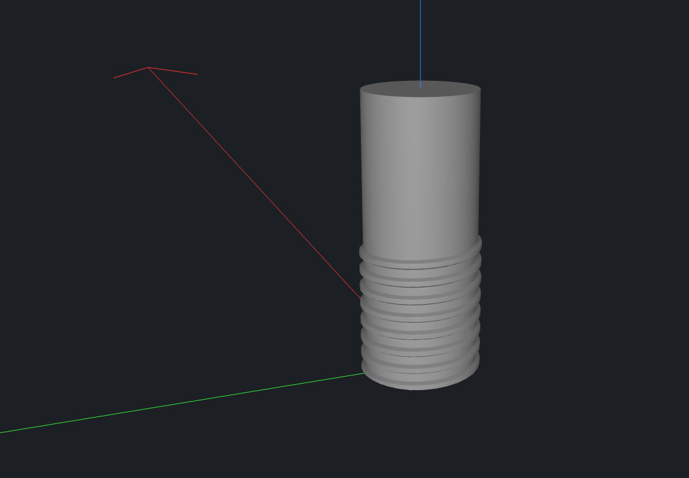

# Introduction to CodeCAD

## What is CodeCAD?

CodeCAD is a lightweight, Lua-based framework for building **parametric 3D CAD models**. It is designed for **simplicity, speed, and reproducibility**.

Its goals are:

- ✍️ **Model in plain code** – Scripts are as close as possible to how you’d describe the object to another human.
- 🔧 **Parametric by design** – Change dimensions, diameters, or wall thicknesses with a single variable.
- 📤 **Robust output** – Export to high-quality formats like STEP and STL for downstream CAD/CAM and 3D printing.
- 📄 **Text-based and open** – Models are plain Lua files, editable in any text editor, storable in Git.
- ⚙️ **Powered by OCCT** – The engine is based on [OpenCascade](https://www.opencascade.com/), a robust industry-grade kernel.

With CodeCAD you can create fully parametric models with a very small amount of code. For example, this script builds a rod with threads:

```lua
local spec = ThreadSpec.new()
spec.fitDiameter = 8.0
spec.pitch = 1.25
spec.depth = 0.6

local part = threaded_rod(20.0, 10.0, spec)
emit(part)
```

That may look simple, but it’s already producing a real M8 threaded rod that can be 3D printed.

<figure markdown>
    
    <figcaption>A threaded rod with simple code.</figcaption>
</figure>

## CodeCAD is a library — GUIs are optional

CodeCAD is intentionally designed as a GUI-less library. You work in Lua files and let the system render your geometry in the included viewer.

This makes CodeCAD extremely flexible:

- 🔬 usable for research and automation pipelines
- ⚙️ embed into engineering workflows
- 💻 drive from scripts or even web services

A minimal viewer is provided for live preview while coding, but the engine itself stays headless and embeddable.

## Why CodeCAD instead of OpenSCAD or CadQuery?

Like **OpenSCAD** and **CadQuery**, CodeCAD is open-source, script-based, and parametric.
But CodeCAD focuses on a different sweet spot: lightweight, clean, and practical for everyday design.

- Lua instead of DSL or Python<br>
  Lua is extremely lightweight, clean, and embeddable. The syntax stays minimal, but flexible enough to express complex geometry.
- OCCT instead of CGAL<br>
  OpenCascade (OCCT) supports advanced CAD operations out-of-the-box: NURBS, splines, sewing, STL repair, STEP import/export, and robust boolean operations.
- Concise API<br>
  Less boilerplate. You write fewer lines of code to create useful parts, thanks to a functional, high-level Lua interface.
- 3D printing in mind<br>
  Threads, chamfers, fillets, and pipe transitions are provided as first-class tools, optimized for additive workflows.
- Fast iteration<br>
  Edit your script, save, and instantly preview in the built-in viewer.

### Compared to OpenSCAD

- ✅ General-purpose Lua instead of a limited DSL.
- ✅ OpenCascade kernel instead of CGAL including advanced CAD features.
- ✅ Extensible: full Lua logic, not just CAD expressions.

### Compared to CadQuery

- ✅ Same OCCT kernel, so geometry robustness is comparable.
- ✅ Simplified API: high-level operations only, no complex OCCT internals exposed.
- ✅ Lightweight runtime: Lua has almost no dependencies.
- ✅ Easier for scripting and automation, without requiring the full Python ecosystem.

In short:

- OpenSCAD is approachable but limited.
- CadQuery is powerful but heavy.
- CodeCAD is the sweet spot: simple, lightweight, parametric, yet backed by industrial-grade geometry.

## Why Lua?

- 🐚 Minimal – a tiny language with no extra baggage.
- 📦 Embeddable – runs anywhere, integrates into services and apps easily.
- 🧩 Customizable – the Lua API can evolve into a domain-specific CAD language.

Lua keeps CodeCAD approachable for beginners, while being powerful for advanced users.

## Who is CodeCAD for?

- 🧑‍🔧 Makers – Model printable parts without a steep CAD learning curve.
- 🏭 Engineers – Prototype mechanical assemblies with real-world accuracy.
- 🔬 Researchers – Explore geometry and algorithms in a reproducible way.
- 👩‍💻 Developers – Treat CAD like code: version it, test it, and share it.

💡 CodeCAD is for those who want to think in code, design in code, and print from code.
